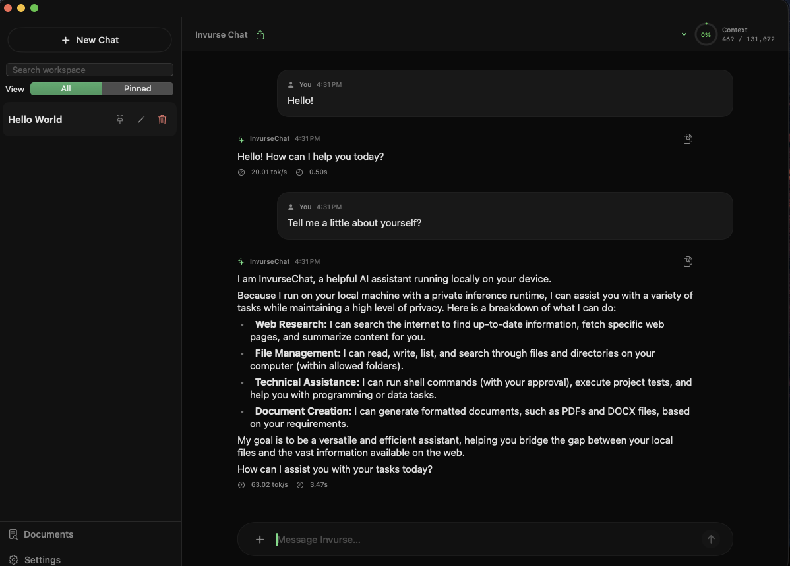

  

<h1 align="center">InvurseChat</h1>

  <strong>Private AI that runs on your Mac.</strong> 
  Open models like Gemma and Qwen, running on your own hardware. 
  Chat from your Mac or your Windows PC. Your conversations never leave home.

  
  
  
  
  

  
  &nbsp;
  

<!-- SCREENSHOT: replace with a 0.6.0 screenshot (new icon, model picker, lavender accent) before launch. -->

  

---

## Why InvurseChat

<table>
<tr>
<td width="50%" valign="top">

### 🔒 Private by design
The model runs on your Mac and your chats are saved there. No account, no
cloud, no analytics. Nothing to sign up for.

</td>
<td width="50%" valign="top">

### ⚡ Fast on Apple Silicon
Built on MLX, with llama.cpp for GGUF models. First-run setup picks a model
that fits your Mac's memory.

</td>
</tr>
<tr>
<td valign="top">

### 🔎 Any model you like
Search Hugging Face from the app and see at a glance whether a model fits.
Or add the models you already have, including an LM Studio library.

</td>
<td valign="top">

### 📎 Works with your files
Drop in PDFs, Word documents, spreadsheets, text and images, and ask about
them. It can search the web when a question needs current information.

</td>
</tr>
<tr>
<td valign="top">

### ✅ You stay in control
Deleting or moving files, running commands and exporting documents all wait
for your approval. You see each step as it works.

</td>
<td valign="top">

### 💻 Your Mac, from your PC
Pair a Windows PC with a one-time code and chat with your Mac's model from
there. Other apps can use it too, through an OpenAI-compatible API.

</td>
</tr>
</table>

## Download

Grab the latest version from the **[Releases page](../../releases/latest)**.

| | Mac | Windows |
| --- | --- | --- |
| **File** | `InvurseChat-<version>-arm64.dmg` | `InvurseChat-Setup-<version>-x64.exe` |
| **Role** | Runs the model and keeps your chats | Chat client for your Mac |
| **Needs** | Apple Silicon (M1 or later), macOS 14 or later | Windows 10 or 11 (x64), and InvurseChat on a Mac on the same network |

### How much memory do I need?

| Model | Minimum | Recommended | Download |
| --- | --- | --- | --- |
| Gemma 4 E2B | 8 GB | 12 GB | ~2 GB |
| Gemma 4 E4B | 12 GB | 16 GB | ~4.5 GB |
| Gemma 4 26B | 24 GB | 32 GB | ~28 GB |

Not sure? The app looks at your Mac and recommends one the first time you
open it.

## Getting started

<strong>On your Mac</strong>

1. Open the DMG and drag **InvurseChat** to **Applications**.
2. Open InvurseChat. Setup recommends a model for your Mac and downloads it.
3. Start chatting. Attach files with **+** or by dragging them in.

<strong>On your Windows PC</strong>

1. Run `InvurseChat-Setup-<version>-x64.exe`.
   The installer isn't code-signed yet, so Windows SmartScreen may say
   "Windows protected your PC". Choose **More info**, then **Run anyway**.
2. On your Mac, open InvurseChat **Settings**, turn on **Allow network
   access**, and choose **Pair a Device…**.
3. Enter the code shown on your Mac in the Windows app.

## Updates

The Mac app checks for new versions and installs them for you (you can turn
this off in Settings, or choose **InvurseChat › Check for Updates…** at any
time). Every update is signed, and checked before it's installed.
The Windows app doesn't update itself yet: download the new installer from
the [Releases page](../../releases/latest).

## FAQ

<strong>Does it work offline?</strong>

Yes. Once a model is downloaded, chatting works with no internet connection.
Only web searches, weather, model downloads and update checks need to go
online.

<strong>Does it work on an Intel Mac?</strong>

No. Running models locally needs Apple Silicon (M1 or later).

<strong>Can I use it away from home on my PC?</strong>

The Windows app connects to your Mac over your local network, so both need to
be on the same network, and your Mac needs to be on.

<strong>Can I use my own models?</strong>

Yes. Search Hugging Face for any MLX or GGUF model from the app, or add a
folder of models you already have.

<strong>What about iPhone and iPad?</strong>

Companion apps are on the way in a future update.

## About

InvurseChat is my first major app. I started it to learn how local AI really
works: running models on a Mac, streaming replies, tools, and connecting other
devices. Along the way it grew into the app I wanted to use every day.

It's made by one person at Invurse Studio in Canada, and it's still early. It's
also signed and notarized by Apple, updates itself safely, and never collects
your data. If something's rough or you have an idea,
[let me know](#feedback). Feedback is how it gets better.

I used Claude, Anthropic's AI, along the way to find bugs, review code, and
implement fixes and polish.

## Privacy

InvurseChat collects nothing: no accounts, analytics or tracking. Read the
full [privacy policy](PRIVACY.md).

## Feedback

Found a bug or have an idea? [Open an issue](../../issues/new) on GitHub, or
email [hello@invursestudio.com](mailto:hello@invursestudio.com) if you don't
have a GitHub account.

---

   
  Developed in Canada 🍁 by <strong>Invurse Studio</strong>

